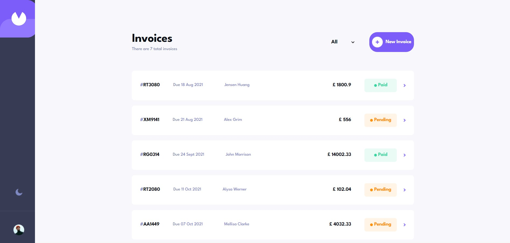

# Frontend Mentor - Invoice app solution

This is my solution to the [Invoice app challenge on Frontend Mentor](https://www.frontendmentor.io/challenges/invoice-app-i7KaLTQjl). Frontend Mentor challenges help me improve my coding skills by building realistic projects.

## Table of contents

- [Overview](#overview)
  - [The challenge](#the-challenge)
  - [Screenshot](#screenshot)
  - [Links](#links)
- [My process](#my-process)
  - [Built with](#built-with)
  - [What I learned](#what-i-learned)
- [Author](#author)

## Overview

### The challenge

Users should be able to:

- View the optimal layout for the app depending on their device's screen size
- See hover states for all interactive elements on the page
- Create, read, update, and delete invoices
- Receive form validations when trying to create/edit an invoice
- Save draft invoices, and mark pending invoices as paid
- Filter invoices by status (draft/pending/paid)
- Toggle light and dark mode

### Screenshot

### Links

- Solution URL: [GitHub Repo](https://github.com/TedJenkler/Invoiceapp-vite-tailwind-reduxtoolkit)
- Live Site URL: [Live Demo](https://tedjenkler.github.io/Invoiceapp-vite-tailwind-reduxtoolkit/)

## My process

### March 12, 2024

- Installed gh pages
- Fixed small details
- Fixed style details and total calculation bug
- Added hover states
- Added edit invoice validation
- Styled form validation
- Added validation logic and fixed add reducer bug
- Hover effects

### March 11, 2024

- Styled form validation
- Added validation logic and fixed add reducer bug
- hover effects

### March 10, 2024

- Completed tablet version of invoice app
- Completed tablet version of add invoice
- Merged main branch
- Worked on invoice editing

### March 9, 2024

- Completed tablet version of view invoice
- Refactored code to remove duplicates
- Implemented responsive design based on viewport
- Converted items in map to grid from flex

### March 8, 2024

- Implemented dark/light mode toggle
- Styled invoice view in dark mode
- Completed dark mode for app and invoice display
- Added empty invoice feature
- Added confirmation for delete action
- Fixed bugs with total calculation and trashcan not working
- Generated random ID and styled buttons
- Added functionality for adding invoice, pending form validation

### March 7, 2024

- Completed editing invoice feature
- Prepared dispatch for data management
- Connected inputs with useState
- Styled edit invoice form
- Made delete action functional
- Styled view invoice page
- Mapped out invoice details on view invoice page
- Set up navigation to view invoice page
- Styled controll component
- Installed React Router
- Installed Vite and Tailwind CSS
- First commit

### Built with

- Semantic HTML5 markup
- Flexbox
- [React](https://reactjs.org/) - JavaScript library for building user interfaces.
- [Vite](https://vitejs.dev/) - Build tool that focuses on providing a fast development experience.
- [Tailwind CSS](https://tailwindcss.com/) - Utility-first CSS framework for quickly building custom designs.
- [Redux Toolkit](https://redux-toolkit.js.org/) - Package that helps manage state in React applications.
- [React Router v6](https://reactrouter.com/) - Routing library for React applications.

### What I learned

During this project, I improved my ability to work with state management and conditional styling in React. Understanding how to manage state effectively allowed me to create dynamic and interactive user interfaces. Additionally, implementing conditional styling based on different states enhanced the visual appeal and usability of the application.

## Author

- Website - [TeodorJenkler](https://www.linkedin.com/in/tedjenklerwebdeveloper/)
- Frontend Mentor - [@TedJenkler](https://www.frontendmentor.io/profile/TedJenkler)